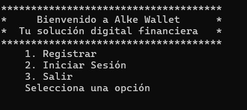
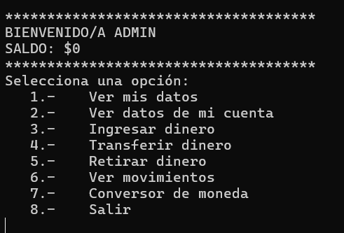

# Evaluacion Integradora Módulo 2
## Proyecto Alke Wallet 

**Situación inicial** 📍

Unidad solicitante: Equipo de desarrollo de una empresa fintech  
📌El equipo de desarrollo ha recibido la solicitud de crear una wallet digital para la empresa Alkemy Digital. La problemática a resolver es brindar a los usuarios una solución segura y fácil de usar para administrar sus activos financieros de manera digital. La wallet permitirá a los usuarios realizar transacciones dentro de la plataforma. 

**Nuestro objetivo** 🎯 

El objetivo de nuestro proyecto "Alke Wallet" es desarrollar una billetera digital que permita a los usuarios gestionar sus activos financieros de manera segura y conveniente. Nuestro objetivo es entregar una aplicación funcional, segura y fácil de usar que proporcione a los usuarios una solución confiable para administrar sus activos financieros de manera digital.
 
**Requerimientos** 📋 

La aplicación "Alke Wallet" deberá cumplir con una serie de requisitos y especificaciones técnicas para garantizar su funcionalidad y calidad.  A continuación, se detallan los requerimientos generales y técnicos:   
Requerimientos generales: 
● Administración de fondos: El programa debe permitir crear una cuenta, ver su saldo disponible, realizar ingreso y retiro de dinero (debe impactar sobre el saldo actual). 
● Conversión de moneda: El programa debe permitir convertir el saldo de un tipo de moneda a otra.   

Requerimientos técnicos/específicos: 
● Backend: Java implementando el paradigma orientado a objetos para desarrollar y gestionar la lógica del negocio. Utilizar interfaces para reutilización de código. 
● Diagramas de clase: Representar en un Diagrama de Clases el modelo de clases que da solución a los requerimientos. 
● Pruebas unitarias: Se realizarán pruebas unitarias para garantizar la calidad y el correcto funcionamiento de los componentes desarrollados.

**Tecnologías Utilizadas** 💻  
● JAVA  
● JUNIT  
● StarUML  

### El programama 👨‍💻
La aplicación cuenta con un menú de inicio, donde se muestra una bienvenida y un menú con las siguientes opciones:  
- Registrar
- Iniciar Sesión
- Salir
 

 
Al registrarse solicita algunos datos para crear un Usuario.
Al iniciar Sesión con el correo y la contraseña se despliega un menú con las siguientes opciones:  

- Ver mis datos 
- Ver datos de mi cuenta
- Ingresar dinero
- Transferir dinero
- Retirar dinero
- Ver movimientos
- Ir a conversor de moneda
- Salir  

 

**A modo de prueba se trabajó con lista para guardar los usuarios. En esta lista hay dos usuarios ingresados. Si desea inicar sesión directamente puede utilizar cualquiera de estos usuarios.**   
Correo Usuario 1: admin@correo.cl 
Clave Usuario 1: admin123   
Correo Usuario 2: homero@correo.cl 
Clave Usuario 2: homero123  

**Tammbién puede selecciónr la opción "Registrar" para crear un nuevo usuario que se agregará a la lista.**  

Por el momento solo se puede realizar transferencia a un usuraio que se encuentre registrado en la app **AlkeWallet**, por lo que para realizar una transferencia de prueba puede escoger uno de los usuarios de la lista o usuario nuevo registrado mientras la aplicación se está ejecutando. 

